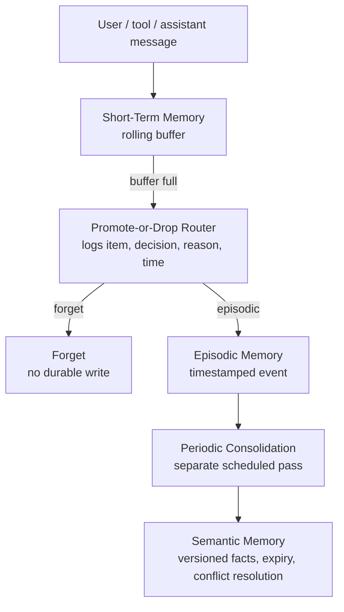

# Nexlink-Telecom-A-Technical Support

## The Company & The Problem

**Nextlink** is an Internet Service Provider (ISP) dealing with a high volume of customer support requests. Human agents are currently overwhelmed by routine tasks: diagnosing router LED codes, upgrading/downgrading customer billing tiers, and dispatching field technicians for physical line repairs. 

The core technical problem is bridging the gap between messy, unpredictable inputs and high-stakes database executions:
* **Messy Inputs:** Customers describe hardware failures in non-technical terms ("the dog chewed the white wire"), and routers output unstructured, noisy error logs. Standard deterministic scripts crash trying to parse this data.
* **High-Stakes Actions:** Standard, unconstrained LLMs are too dangerous to trust with billing databases. If an AI hallucinates a  "Free Internet" plan or accidentally dispatches a technical support onsite (just because the router needed a restart), the financial damage is immediate and the support quality suffers.

## Memory System

Nexlink support conversations are tool-heavy and often span an outage, an identity check, and a later follow-up. Losing a prior dispatch outcome or a customer's contact preference forces agents to repeat work; keeping all raw diagnostic JSON eventually buries the live support task. The `memory/` extension separates short-lived working context from durable evidence without letting transient chat silently become customer knowledge.

### Design

| Concern | Implementation |
| --- | --- |
| Short-term memory | `ShortTermMemory` is an ordered rolling buffer (`max_items=20` by default). Eviction is the only place routing runs. |
| Scratchpad | Separate `plan`, `current_subgoal`, and `working_state` dictionary; transcript pruning cannot erase it. |
| Promote or drop | `PromoteOrDropRouter` decides only `forget` or `episodic`. Every decision and its reason is stored in `routing_log`; it **cannot write semantic memory**. |
| Episodic memory | SQLite `episodes` preserves timestamped customer support events and their original message; candidate event recalls are filtered and verified before prompt injection. |
| Periodic consolidation | `ConsolidationLayer.run_if_due()` reads only unconsolidated episodes. It extracts stable facts, versions prior values, expires 90-day facts, and records every run. |
| Conflict resolution | Newer timestamped episode wins, while the old semantic value remains in `semantic_versions` as `superseded`; `MemorySystem.fact_history()` exposes the full timeline. |
| Self-RAG verification | `verify_memory_recall` checks relevance and whether a proposed claim is supported by the evidence; unsupported recall is withheld. |

This is a real separation of duties: the router stores evidence (or drops it); the independent periodic job derives semantic facts later. No router path calls `upsert_fact`.

### Why this design

We chose this pipeline because Nexlink has two competing needs: the agent needs a small, fast prompt during noisy diagnostics, but customer facts must not be discarded or promoted blindly. Keeping the routing decision at eviction limits the work on each turn; keeping semantic writing in a separate periodic pass lets the system compare new evidence against existing facts before it changes what the agent believes. This is important for support data that changes, such as a customer's preferred contact method, a dispatch outcome, or an outage status.



The `routing_log` is an auditable table with the original item, destination, reason, and timestamp. `python -m memory.demo` prints it in a grader-visible table instead of leaving it hidden in SQLite.

### Run the memory evidence demo

```powershell
python -m memory.demo
python -m unittest memory.test_memory -v
```

The demo visibly shows all requested cases:

1. `Thanks!` is evicted and logged as **forget**.
2. A customer contact preference is promoted to **episodic**, then consolidated.
3. A later `SMS -> email` preference event creates a version and resolves the conflict in favor of newer evidence.
4. The 90-day expiration pass marks stale facts expired.
5. The scratchpad remains after rolling-buffer eviction and verified recall is shown before the prompt is built.

### Test coverage

`memory/test_memory.py` verifies the four required memory outcomes: **forget**, **episodic promotion**, **semantic conflict/versioning**, and **expiration**. It also checks that unsupported recalled claims fail verification.

### Agent integration

`agent/agent.py` now creates `MemorySystem` alongside the existing MCP client. Each user/assistant turn enters the rolling buffer, the periodic consolidator is checked, and only verified episodic/semantic memories are injected as a system context message. Memory tables are additive tables in the existing `db/nextlink.db`, so the extension visibly reuses the project database without copying or changing the existing MCP schema; the database itself is not committed by this module.

## RAG Retrieval Architectures

Nextlink's knowledge base (policies, error codes, hardware specs, troubleshooting guides) is served by four retrieval architectures, all benchmarked offline on 15 domain questions in `retrieval_eval/results.md` (regenerate with `python retrieval_eval/run_eval.py --provider offline`):

| Architecture | Task Accuracy | Avg Input Tokens | Avg Latency (s) |
| --- | --- | --- | --- |
| Naive RAG | 13/15 | 281 | 0.02s |
| Hybrid (vector + BM25) | 14/15 | 309 | 0.00s |
| Agentic RAG | 15/15 | 326 | 0.06s |
| Graph RAG (knowledge graph) | 15/15 | 711 | 0.01s |

Graph RAG (implemented in `rag/graph_rag.py`) builds an in-memory knowledge graph: consecutive chunks of a document are linked, and chunks sharing a distinctive identifier (`ERR-xxxx` error code or `Nextlink-...-V<n>` model) are linked too. Hybrid search seeds the context verbatim, personalized PageRank selects the reachable neighborhood, and the best candidates by semantic similarity are appended. This pulls in the cross-document evidence a flat ranker misses -- e.g. the *definition* of `ERR-6602` behind a policy that cites it -- at the cost of more input tokens.

The agent routes to the cheapest sufficient architecture via `_route()` in `agent/agent.py` (hybrid by default, agentic for multi-hop questions). Self-RAG verification is gated by `RAG_VERIFY_RELEVANCE_THRESHOLD`; see `.env.example`.

## The Solution

We built an **MCP (Model Context Protocol) Server** to act as a secure, intelligent bridge. 
### Note: to be written once we have figured out all the features.

## Person 1: Network Outage Diagnosis and Field Dispatch

`graphs/outage/workflow.py` is a durable, explicit state graph for a real ISP outage: `RECEIVED -> NORMALIZING -> DIAGNOSING -> HYPOTHESIS_GENERATION -> VERIFYING -> DECIDING`, then either `HITL -> WAITING_FOR_HUMAN -> DISPATCHING -> WAITING_FOR_FIELD -> VERIFY_RESOLUTION -> COMPLETED` or a monitor/verification route. A failed field visit loops back to diagnosis. Deterministic code owns every edge; a low-confidence diagnosis or any physical-line dispatch is a real human gate.

LATS is bounded to three evidence-scored outage candidates, stored in state; its winner determines whether a dispatch requires approval. The verification node is a bounded constrained-ReAct tool loop: only five named outage operations are permitted, each input/output is validated, and each call is persisted in `outage_tool_audit`. This prevents an LLM from accessing arbitrary MCP capabilities.

`shared/checkpointing/` is reusable by every graph and records immutable SQLite checkpoints after each meaningful node transition. `shared/outage_persistence.py` adds incidents, runs, hypotheses, tool audit, HITL tasks, and failure tickets to the existing database. HITL (`pending/approved/rejected/modified`) is an expected business pause: the graph creates a durable admin task, waits, and uses the persisted admin decision to choose its next edge. Unexpected tool/schema/runtime errors instead create a distinct `failure_tickets` row (`open/investigating/resolved`); the graph cannot resume until an admin resolves that ticket. The idempotency ledger prevents completed dispatch side effects from repeating after restart.

The FastAPI surface is `backend/app.py`. The Next.js console is a single app in `frontend/` with routes for the admin dashboard (`/`), support chat (`/chat`), and outage operations (`/outages`). The outage page lists incidents, opens persisted detail, and submits admin HITL decisions to the same backend. API endpoints include incident creation/list/details, checkpoint/tool history, HITL decisions, field results, tickets, and ticket recovery.

### Run and demo

```powershell
python -m pip install -r requirements.txt
uvicorn backend.app:app --reload
cd frontend; npm install; npm run dev
# POST /api/outages with {"account_id":1,"symptoms":["no internet"]}; approve via the UI/API; POST field-result.
python scripts/outage_recovery_demo.py
# launches a child process, kills it after its DIAGNOSING checkpoint,
# then starts a fresh process that loads and resumes the saved state.
```

The legacy planning correction remains intentionally small: `planning/planning_lab/algorithms/decomposition.py` preserves the caller goal, validates structured DAG output, runs real MCP-bound tasks through the executor, and avoids planning invented tools.

## Two LLM-Call Additions per State Graph

Each state graph integrates two of the four allowed LLM-call techniques inside specific nodes. The pairing was chosen per problem shape, not for coverage; every addition fails closed to a documented deterministic fallback so the graphs stay runnable offline (set `NEXLINK_GRAPH_LLM=0` to force the fallbacks, e.g. in unit tests).

| State graph | Node(s) | Technique | Why this problem needs it here | Why not the other techniques |
| --- | --- | --- | --- | --- |
| Outage diagnosis (`graphs/outage/`) | HYPOTHESIS_GENERATION (`_lats`) | LATS | Three competing failure hypotheses must be evidence-scored before dispatch; a wrong winner sends a $150 truck roll | No knowledge corpus is consulted during diagnosis; RAG adds nothing |
| Outage diagnosis (`graphs/outage/`) | VERIFYING (`_constrained_react`) | Constrained ReAct | Verification probes several tools step-by-step; the whitelist keeps the model away from arbitrary MCP capabilities and every call is audited | The candidate set is already fixed — no search over thought branches needed |
| SLA dispute (`graphs/sla_dispute/nodes.py`) | `store_sla_evidence` | RAG architecture | Liability hinges on which credit/outage policy clauses apply to *this* claim; retrieval grounds the decision in the matching terms from the shared policy vector store instead of one hardcoded file, reusing the corpus the support agent indexes | No multi-step action sequence exists to constrain; no plan to decompose |
| SLA dispute (`graphs/sla_dispute/nodes.py`) | `select_root_cause` | Tree of Thoughts | Every candidate root cause is a branch scored against the claim evidence; the chosen branch plus its reasoning is persisted in state because picking wrong flips liability between provider and customer | LATS look-ahead adds nothing once the small candidate set is generated upstream |
| Order activation (`graphs/order_activation/`) | START (`_handle_start` → `decompose_activation_request`) | Task decomposition | Activation is several dependent provisioning steps whose order and parameters depend on the specific order (coverage check → equipment model by plan tier → configure); the plan is persisted on `ActivationData.provisioning_plan` and checkpointed, so resumes continue the same plan | There are no competing hypotheses to weigh (no ToT/LATS) and no policy corpus to retrieve (no RAG) |
| Order activation (`graphs/order_activation/llm_additions.py`) | CONFIGURE_EQUIPMENT (`run_equipment_react`) | Constrained ReAct | Equipment selection/assignment depends on plan tier and stock, so the model reasons tool-by-tool — but only `check_equipment_available`, `assign_equipment` and `configure_equipment` are whitelisted; service activation itself stays outside the model's reach, hard-gated in graph code | No knowledge lookup is involved in provisioning; decomposition already happened at START |


## Database Architecture

To execute provisioning and diagnostics, the MCP server connects to a local relational database (SQLite). The schema enforces strict data integrity using `AUTOINCREMENT` integer primary keys, explicit foreign key relations, and strict `CHECK` constraints to emulate Enums for equipment statuses and ticketing.

The database is built and populated using `db/setup_db.py`, which executes:
1. **`schema.sql`**: Defines the strict table boundaries.
2. **`seed.sql`**: Injects varied test scenarios, including active users, users with raw hardware failure syslogs, and open support tickets.

### Entity-Relationship Diagram (ERD)

Everything branches securely off the central `ACCOUNTS` table, ensuring the agent cannot query equipment or manipulate billing without a valid account context.


