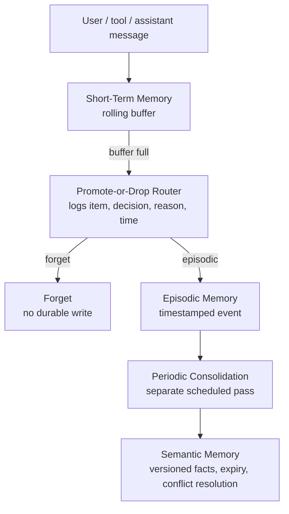

# Nexlink-Telecom-A-Technical Support

## The Company & The Problem

**Nextlink** is an Internet Service Provider (ISP) dealing with a high volume of customer support requests. Human agents are currently overwhelmed by routine tasks: diagnosing router LED codes, upgrading/downgrading customer billing tiers, and dispatching field technicians for physical line repairs. 

The core technical problem is bridging the gap between messy, unpredictable inputs and high-stakes database executions:
* **Messy Inputs:** Customers describe hardware failures in non-technical terms ("the dog chewed the white wire"), and routers output unstructured, noisy error logs. Standard deterministic scripts crash trying to parse this data.
* **High-Stakes Actions:** Standard, unconstrained LLMs are too dangerous to trust with billing databases. If an AI hallucinates a  "Free Internet" plan or accidentally dispatches a technical support onsite (just because the router needed a restart), the financial damage is immediate and the support quality suffers.

## Memory System

Nexlink support conversations are tool-heavy and often span an outage, an identity check, and a later follow-up. Losing a prior dispatch outcome or a customer's contact preference forces agents to repeat work; keeping all raw diagnostic JSON eventually buries the live support task. The `memory/` extension separates short-lived working context from durable evidence without letting transient chat silently become customer knowledge.

### Design

| Concern | Implementation |
| --- | --- |
| Short-term memory | `ShortTermMemory` is an ordered rolling buffer (`max_items=20` by default). Eviction is the only place routing runs. |
| Scratchpad | Separate `plan`, `current_subgoal`, and `working_state` dictionary; transcript pruning cannot erase it. |
| Promote or drop | `PromoteOrDropRouter` decides only `forget` or `episodic`. Every decision and its reason is stored in `routing_log`; it **cannot write semantic memory**. |
| Episodic memory | SQLite `episodes` preserves timestamped customer support events and their original message; candidate event recalls are filtered and verified before prompt injection. |
| Periodic consolidation | `ConsolidationLayer.run_if_due()` reads only unconsolidated episodes. It extracts stable facts, versions prior values, expires 90-day facts, and records every run. |
| Conflict resolution | Newer timestamped episode wins, while the old semantic value remains in `semantic_versions` as `superseded`; `MemorySystem.fact_history()` exposes the full timeline. |
| Self-RAG verification | `verify_memory_recall` checks relevance and whether a proposed claim is supported by the evidence; unsupported recall is withheld. |

This is a real separation of duties: the router stores evidence (or drops it); the independent periodic job derives semantic facts later. No router path calls `upsert_fact`.

### Why this design

We chose this pipeline because Nexlink has two competing needs: the agent needs a small, fast prompt during noisy diagnostics, but customer facts must not be discarded or promoted blindly. Keeping the routing decision at eviction limits the work on each turn; keeping semantic writing in a separate periodic pass lets the system compare new evidence against existing facts before it changes what the agent believes. This is important for support data that changes, such as a customer's preferred contact method, a dispatch outcome, or an outage status.



The `routing_log` is an auditable table with the original item, destination, reason, and timestamp. `python -m memory.demo` prints it in a grader-visible table instead of leaving it hidden in SQLite.

### Run the memory evidence demo

```powershell
python -m memory.demo
python -m unittest memory.test_memory -v
```

The demo visibly shows all requested cases:

1. `Thanks!` is evicted and logged as **forget**.
2. A customer contact preference is promoted to **episodic**, then consolidated.
3. A later `SMS -> email` preference event creates a version and resolves the conflict in favor of newer evidence.
4. The 90-day expiration pass marks stale facts expired.
5. The scratchpad remains after rolling-buffer eviction and verified recall is shown before the prompt is built.

### Test coverage

`memory/test_memory.py` verifies the four required memory outcomes: **forget**, **episodic promotion**, **semantic conflict/versioning**, and **expiration**. It also checks that unsupported recalled claims fail verification.

### Agent integration

`agent/agent.py` now creates `MemorySystem` alongside the existing MCP client. Each user/assistant turn enters the rolling buffer, the periodic consolidator is checked, and only verified episodic/semantic memories are injected as a system context message. Memory tables are additive tables in the existing `db/nextlink.db`, so the extension visibly reuses the project database without copying or changing the existing MCP schema; the database itself is not committed by this module.

## The Solution

We built an **MCP (Model Context Protocol) Server** to act as a secure, intelligent bridge. 
### Note: to be written once we have figured out all the features.

## Database Architecture

To execute provisioning and diagnostics, the MCP server connects to a local relational database (SQLite). The schema enforces strict data integrity using `AUTOINCREMENT` integer primary keys, explicit foreign key relations, and strict `CHECK` constraints to emulate Enums for equipment statuses and ticketing.

The database is built and populated using `db/setup_db.py`, which executes:
1. **`schema.sql`**: Defines the strict table boundaries.
2. **`seed.sql`**: Injects varied test scenarios, including active users, users with raw hardware failure syslogs, and open support tickets.

### Entity-Relationship Diagram (ERD)

Everything branches securely off the central `ACCOUNTS` table, ensuring the agent cannot query equipment or manipulate billing without a valid account context.


