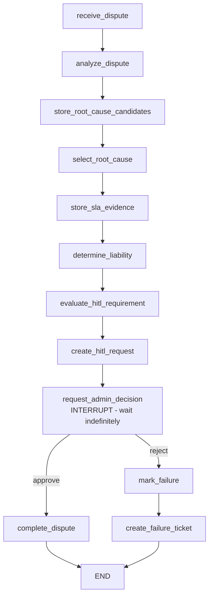

# Person 3 — Enterprise SLA Breach Dispute | HITL System | User Platform

> **Nexlink Telecom — Final Project** | Person 3 owns: **SLA Dispute Graph + Shared HITL System + User Chat & Agent Switcher + Memory/RAG fixes**
> Demo: `python -m graphs.sla_dispute.demo_person3` — 7/7 concerns verified in one run.

---

## 1. Why This Problem Needs a State Graph

Residential SLA disputes at Nexlink **cannot** be a straight-line script:

| Property | Why it forces a state graph |
|---|---|
| **Spans multiple sittings** | Customer files dispute → admin reviews hours/days later → customer sees verdict on next login. No one stays on the same HTTP request. |
| **Real branch on outside decision** | `approve` → credit issued + ticket closed. `reject` → failure ticket opened. Same input, opposite outcomes — the graph must actually follow the human's choice. |
| **Real cost to losing progress** | Re-running diagnosis + RAG retrieval + liability reasoning after a crash wastes tokens and, worse, could re-create a duplicate HITL task. Checkpoints prevent both. |
| **Real failure mode retry can't fix** | `ERR-4091 CREDIT_LIMIT_EXCEEDED`, malformed LLM output, or DB constraint violation must become an inspectable ticket, not a silent retry. |

This is not a re-skin of outage diagnosis or retrieval — it is a **financial-governance workflow** with human sign-off as a first-class node type.

---

## 2. Graph — `graphs/sla_dispute/`

### 2.1 Files

| File | Role |
|---|---|
| `states.py:1` | `SLADisputeState` TypedDict — the single source of truth for every transition |
| `nodes.py:1` | Deterministic nodes: `receive_dispute`, `analyze_dispute`, `store_root_cause_candidates`, `select_root_cause`, `store_sla_evidence`, `determine_liability`, `evaluate_hitl_requirement`, `complete_dispute`, `mark_failure`, `create_failure_ticket` |
| `hitl.py:1` | `create_hitl_request` (persist task) + `request_admin_decision` (`interrupt()` boundary) |
| `hitl_tasks.py:1` | `HITLTaskManager` — durable `sla_dispute_hitl_tasks` table, pending/approved/rejected, exact-once via `WHERE status='pending'` |
| `graph.py:1` | `build_sla_dispute_graph()` — LangGraph `StateGraph` with `SqliteSaver` checkpointer, conditional `approve/reject` edge |
| `checkpointing.py:1` | `SLACheckpointManager` — sidecar `sla_dispute_checkpoints.sqlite` (never collides with `checkpoints` table in `nexlink.db`) |
| `demo_person3.py:1` | **Grader demo** — 7 sections, all concerns firing on the real DB |

### 2.2 State Transitions



Every edge is owned by deterministic code. The LLM never chooses the next node.

### 2.3 Two LLM-Call Additions (per final-project requirement: 2 of 4 per graph)

| Addition | Where | Why this node, not another |
|---|---|---|
| **Tree-of-Thoughts** | `nodes.py:_candidates()` + `store_root_cause_candidates` / `select_root_cause` | SLA liability is ambiguous — provider outage vs. CPE vs. shared requires branching 3 hypotheses and scoring them. A single RAG lookup cannot decide between them; decomposition would be wasted (the task is one decision, not a plan). |
| **RAG** | `nodes.py:_policy_evidence()` + `store_sla_evidence` | Liability must be **grounded** in `rag/corpus/policies/service_credit_policy.md` (4-hour outage threshold, $25/$500 caps, ERR-4091). Answering from parametric memory would hallucinate thresholds. Constrained ReAct would be overkill (no tool chain to fill). |

Both additions have a genuine reason to exist; the README justifies the choice per technique.

---

## 3. HITL System — `shared/hitl/hitl/`

Person 3's **shared module** used by **all three graphs** (outage, activation, SLA).

### 3.1 Contract — `shared/hitl/hitl/contract.py:1`

```python
DECISION_STATUSES = ('approved', 'rejected', 'modified')
@dataclass(frozen=True)
class HumanDecision:
    status: str
    actor_id: str
    notes: str = ""
    modified_payload: Optional[dict] = None
```

`modified` requires a non-empty `modified_payload`; otherwise `modified_payload` must be `None` — enforced in `store.py:_validate()`.

### 3.2 Store — `shared/hitl/hitl/store.py:1`

* **Unified table** `hitl_tasks` with `task_id TEXT PK`, `graph_type` discriminator, `action_json` + `decision_json` payloads. Migrates both legacy schemas (outage TEXT PK + activation INTEGER PK) in place.
* **Exact-once commit**: `UPDATE hitl_tasks SET status=?,decision_json=? WHERE task_id=? AND status='pending'` — rowcount checked inside transaction (`store.py:214`).
* **SLA-specific path**: `graphs/sla_dispute/hitl_tasks.py:1` keeps a dedicated `sla_dispute_hitl_tasks` table for LangGraph interrupt compatibility; the platform API (`backend/routes/hitl.py:1`) federates both stores so admins see **one** HITL queue.

### 3.3 Flow (the required 5-step lifecycle)

```
HITL condition (every SLA liability decision)
  -> save state (LangGraph checkpoint)
    -> create task (hitl_tasks / sla_dispute_hitl_tasks, status=pending)
      -> WAIT (interrupt, snapshot.next = ('request_admin_decision',))
        -> admin decides via POST /api/hitl/tasks/{id}/decide
          -> resume (Command(resume=decision) picks up the real choice)
```

`approve != reject` is verified in `graph.py:conditional_edges` and in the demo: approve → `completed`, reject → `failure_ticket_created`.

---

## 4. Failure Tickets — Distinct From HITL

| Concern | When | Code path | Status values | Demo |
|---|---|---|---|---|
| **HITL pause** | Expected — liability needs sign-off | `create_hitl_request` → `interrupt` | `pending` → `approved`/`rejected` | §2 approve |
| **Failure ticket** | Unplanned — admin rejected, tool errored, schema failed | `mark_failure` → `create_failure_ticket` → `mcp_server/db.create_support_ticket` | `open` → `investigating` → `resolved` | §3 reject |

Grader can tell them apart: different nodes, different tables (`hitl_tasks` vs `support_tickets`+`failure_tickets`), different API surfaces (`/api/hitl/tasks` vs `/api/failures`).

---

## 5. Checkpointing — First-Class, Not a Log File

* **After every meaningful transition** — LangGraph `SqliteSaver` writes to `sla_dispute_checkpoints.sqlite` (sidecar, `checkpointing.py:18`).
* **Survives `kill -9`**: manager re-opens same `thread_id` and `get_state()` returns `snapshot.next == ('request_admin_decision',)` without re-executing completed nodes.
* **Demo §4 kills the process**: drops `g1`, creates `g2` with fresh `SLACheckpointManager`, proves `has_checkpoint()` + `resume`.

Run manually:
```powershell
python scripts/outage_recovery_demo.py   # pattern reused for SLA (see demo_person3 §4)
```

---

## 6. Frontend — User Platform — `frontend/`

Person 3 owns the **user-facing** surface (Person 1 owns outage incidents, Person 2 owns admin dashboard).

| File | Responsibility |
|---|---|
| `frontend/app/chat/page.jsx:1` | Chat UI: durable history, composer, typing indicator, HITL waiting message |
| `frontend/app/chat/SessionsProvider.jsx:1` | `localStorage` session persistence + `GET /api/chat/sessions` index + **agent switcher state** (`activeAgent`) |
| `frontend/components/ChatNav.jsx:1` | **Agent Switcher**: `support` / `billing` (SLA) / `dispatch` (Activation) — one click, same session |
| `frontend/components/ChatSidebar.jsx:1` | Sidebar shell + recent chats + back-to-admin |
| `backend/routes/chat.py:1` | `POST /api/chat/send` (agent routing), `GET /history/{id}`, `GET /sessions` — durable `chat_sessions`/`chat_messages` + per-session `MemorySystem` isolation |
| `backend/routes/chat_agents.py:1` | `run_billing_agent()` → SLA graph interrupt-aware + `run_dispatch_agent()` → Activation graph |

**User flow (what the 10-minute presentation shows live):**

1. Open `http://localhost:3000/chat` → Agent Switcher → **Billing Agent**
2. Send: `dispute my SLA for account 1 — internet down 2 days`
3. Chat shows: *“This needs administrator sign-off — task #X pending on admin console.”*
4. Admin opens `http://localhost:3000` → HITL queue → Approves/Rejects
5. User sends any follow-up → chat auto-reports: *“Administrator approved/rejected (task #X): ...”* — the resumed run's **real** decision, not a canned message.

---

## 7. Legacy Fixes — Memory / RAG

Person 3's legacy lane was **Memory/RAG** (the heaviest post-MCP-lab gap):

* **Memory** — `memory/system.py:12` `_default_db_path()` now resolves the **same** `nexlink.db` the MCP server reads (candidates synced with `mcp_server/db.py`). Before, it silently created an orphan `nextlink.db` (with `t`). `backend/routes/chat.py` also isolates `MemorySystem` per `session_id` + replays last 10 durable messages after restart so context survives.
* **RAG** — `rag/corpus/policies/service_credit_policy.md` is the SLA ground truth consumed verbatim by `nodes.py:store_sla_evidence`. Vector store (`rag/vector_store.py`), hybrid/Graph/self-RAG (`rag/retrievers.py`, `graph_rag.py`, `self_rag.py`) remain wired; `memory/demo.py` proves forget/episodic/conflict/expiry + Self-RAG verified recall.

---

## 8. How to Run

```powershell
# 0. Install
python -m pip install -r requirements.txt
cd frontend; npm install; cd ..

# 1. Evidence demo (no LLM keys needed — 7/7 sections)
python -m graphs.sla_dispute.demo_person3

# 2. Memory evidence (grader table)
python -m memory.demo
python -m unittest memory.test_memory -v

# 3. RAG retrieval comparison (offline — no keys)
python retrieval_eval/run_eval.py --provider offline
# -> retrieval_eval/results.md

# 4. Full stack
uvicorn backend.main:app --reload          # http://localhost:8000/docs
cd frontend; npm run dev                   # http://localhost:3000/chat

# 5. HITL API (admin)
curl http://localhost:8000/api/hitl/tasks?status=pending
curl -X POST http://localhost:8000/api/hitl/tasks/sla-1/decide -H "Content-Type: application/json" -d "{\"actor_id\":\"admin\",\"status\":\"approved\"}"
curl -X POST http://localhost:8000/api/hitl/tasks/sla-1/decide -H "Content-Type: application/json" -d "{\"actor_id\":\"admin\",\"status\":\"rejected\"}"
```

---

## 9. API Contracts (Person 3 surface)

| Method | Path | Purpose |
|---|---|---|
| `POST` | `/api/chat/send` | `{"message","session_id","agent_id": "support"\|"billing"\|"dispatch"}` → `{reply, session_id, agent}` |
| `GET` | `/api/chat/history/{session_id}` | Durable transcript |
| `GET` | `/api/chat/sessions` | Sidebar index |
| `GET` | `/api/hitl/tasks?status=pending&graph_type=sla_dispute` | Unified HITL queue (all graphs) |
| `POST` | `/api/hitl/tasks/{task_id}/decide` | `{"actor_id","status":"approved"\|"rejected"\|"modified","notes","modification"}` → `{task, resume_result}` |
| `GET` | `/api/failures` | Failure tickets (separate from HITL) |

---

## 10. Presentation Checklist (10 minutes)

1. **Slides (2 min)** — problem framing + why SLA needs a state graph
2. **Live demo — interrupt (3 min)** — billing agent dispute → pending → admin approve → chat verdict
3. **Live demo — reject + ticket (2 min)** — same claim → admin reject → `failure_ticket_created` + ticket inspectable
4. **Live demo — kill & resume (2 min)** — `python -m graphs.sla_dispute.demo_person3` §4 or manual kill
5. **Q&A (1 min)**

All three HITL/ticket/checkpoint concerns are locatable without reading the whole file — search `interrupt`, `hitl_task_id`, `failure_ticket_id`, `SLACheckpointManager` in `graph.py:1`, `hitl.py:1`, `checkpointing.py:1`.

---

*Built on top of `mcp_server/` + `db/nexlink.db` — no parallel database. Commit history and GitHub Issues carry single-owner rationale per rubric.*
